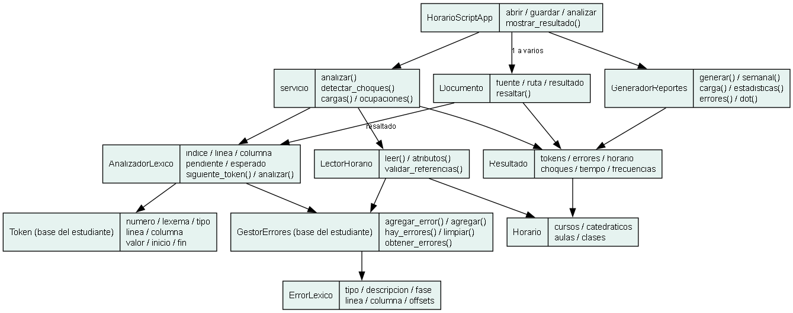
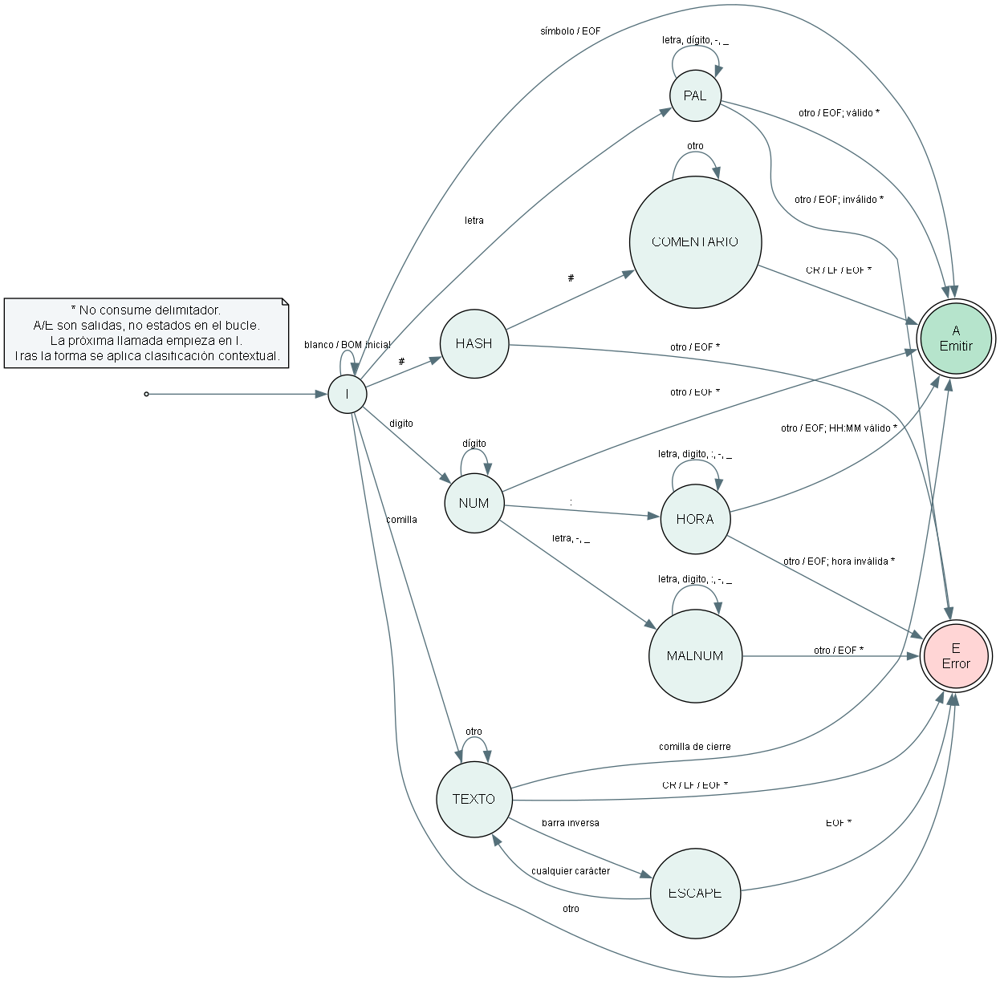
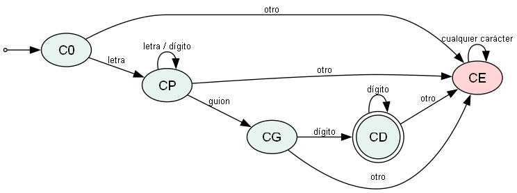

# Manual técnico · HorarioScript

**William René Toledo Corado · 202210198 · B+**

HorarioScript convierte un archivo .hor en tokens, diagnósticos y un modelo de horario. El analizador se implementa manualmente: no importa re ni usa split/find para tokenizar. Python 3.10+ y Tkinter son los únicos requisitos de ejecución; Graphviz es opcional al renderizar el DOT.

## Arquitectura

### Token y GestorErrores
Clases del primer commit del estudiante, ampliadas con valor, offsets y fase; mantienen sus métodos originales.

### AnalizadorLexico
Recorre caracteres, conserva lexemas y produce tokens o errores mediante siguiente_token().

### LectorHorario
Valida bloques, atributos y referencias; construye solo registros utilizables. No mezcla estructura con errores léxicos.

### Servicio y modelos
Coordina fases; detecta choques, suma carga y calcula unión de intervalos de ocupación.

### GUI y reportes
Cada Documento conserva su análisis; GeneradorReportes produce cuatro HTML, DOT, CSV y JSON.

## AFD completo

A/E son salidas; las llamadas reinician I conservando el cursor.

## Tabla de transiciones

| Estado | Entrada | Destino | Acción |

|---|---|---|---|

| I | Espacio, tab, CR, LF; BOM solo inicial | I | Consumir; actualizar posición |

| I | Letra ASCII | PAL | Consumir inicio de palabra |

| I | Dígito ASCII | NUM | Consumir inicio numérico |

| I | Comilla doble | TEXTO | Consumir apertura; valor vacío |

| I | # | HASH | Consumir primer # |

| I | { } [ ] : , ; | A | Consumir y emitir SIMBOLO |

| I | EOF | A | Emitir EOF; no consumir |

| I | Cualquier otro carácter | E | Consumir uno; CARACTER_NO_RECONOCIDO |

| PAL | Letra, dígito, guion o _ | PAL | Consumir secuencia completa |

| PAL | Otro carácter o EOF | A / E | No consumir delimitador; reservada, código o error |

| NUM | Dígito | NUM | Consumir |

| NUM | : | HORA | Consumir |

| NUM | Letra, guion o _ | MALNUM | Consumir; candidato numérico inválido |

| NUM | Otro carácter o EOF | A | No consumir delimitador; emitir ENTERO |

| HORA | Letra, dígito, : guion o _ | HORA | Consumir candidato completo |

| HORA | Otro carácter o EOF | A / E | Validar HH:MM y rango; HORA o HORA_FUERA_DE_RANGO |

| MALNUM | Letra, dígito, : guion o _ | MALNUM | Consumir candidato completo |

| MALNUM | Otro carácter o EOF | E | No consumir; CODIGO_MAL_FORMADO |

| TEXTO | Comilla doble | A | Consumir cierre; CADENA o CODIGO |

| TEXTO | Barra inversa | ESCAPE | Consumir escape |

| TEXTO | CR, LF o EOF | E | No consumir; CADENA_SIN_CERRAR |

| TEXTO | Cualquier otro carácter | TEXTO | Consumir y añadir al valor |

| ESCAPE | EOF | E | CADENA_SIN_CERRAR |

| ESCAPE | CR o LF | TEXTO | Consumir continuación; no añadir al valor |

| ESCAPE | Cualquier otro carácter | TEXTO | Consumir; n/t/r se decodifican, resto literal |

| HASH | # | COMENTARIO | Consumir segundo # |

| HASH | Otro carácter o EOF | E | No consumir; CARACTER_NO_RECONOCIDO |

| COMENTARIO | CR, LF o EOF | A | No consumir; emitir COMENTARIO_LINEA |

| COMENTARIO | Cualquier otro carácter | COMENTARIO | Consumir sin validar contenido |

## Sub-AFD de códigos

Solo CD acepta al finalizar. CE es rechazo absorbente.

## Palabras y códigos
Se consume la secuencia completa y se compara con tablas de igualdad exacta: bloques, elementos, relaciones, atributos, días y categorías. Si no coincide, se aplica el sub-AFD de códigos. La entrada HORARIO1 nunca se divide artificialmente en HORARIO + 1.

## Ambigüedad del ejemplo oficial
La regla escrita dice letras-guion-dígitos, pero BD2-0812 figura como ejemplo válido. Se admite una letra inicial seguida por letras o dígitos antes del guion. Los códigos se aceptan con comillas, como en el ejemplo, o sin ellas, como permiten las reglas de prioridad. Un prefijo iniciado en dígito se rechaza.

## Formas y contexto finito
El AFD identifica formas. _emitir conserva pendiente/esperado para los valores de codigo, aula, clase, con, en, dia, inicio, fin y categoria. Los comentarios no alteran ese contexto. Así un nombre entre comillas sigue siendo CADENA, mientras que un valor inválido después de codigo: genera CODIGO_MAL_FORMADO. No se atribuyen transiciones sintácticas completas al AFD.

## Horas
HORA acumula el candidato completo, incluso caracteres erróneos. minutos_validos exige longitud 5, dos dígitos, dos puntos y otros dos dígitos; calcula h*60+m, exige m<60 y 360<=total<=1260. La forma y el rango se validan después del reconocimiento del candidato. No se admiten horas con comillas.

## Cadenas y comentarios
Se conservan comillas y escapes en lexema y se decodifica valor. Se admiten \" y \\, n/t/r escapados y una nueva línea física escapada como continuación. Otros escapes producen el carácter literal. Una cadena abierta termina en error al encontrar CR/LF no escapado o EOF. Un comentario ## es válido hasta CR, LF o EOF: el caso de “comentario sin cerrar” del enunciado no puede ser un error con esta sintaxis.

## Línea, columna y offsets
Línea y columna comienzan en 1. LF, CR o CRLF cuentan una nueva línea; una tabulación avanza al siguiente tope de cuatro columnas. Un BOM inicial no ocupa columna. Los offsets inicio/fin son índices de caracteres de Python, no de bytes. El editor normaliza saltos a LF; la lectura por consola conserva CRLF. El resaltado y la selección usan offsets sobre el texto que se analizó.

## Recuperación léxica
Un carácter desconocido consume exactamente un carácter. Un candidato de palabra/hora inválido consume su unidad completa hasta un delimitador; una cadena abierta se detiene antes del salto. El método devuelve ERROR_LEXICO interno, agrega un diagnóstico y permite la siguiente llamada. Los tokens válidos tienen numeración consecutiva; EOF y errores no aparecen como tokens válidos.

## Extracción estructural
El lector auxiliar exige HORARIO y las cuatro secciones exactamente una vez, en cualquier orden. Permite coma final entre elementos y sección de clase opcional; exige los atributos requeridos y los separadores. Recupera en un siguiente elemento, sección o cierre. Se rechazan códigos duplicados, valores no positivos, intervalos invertidos y referencias inexistentes. Los catálogos vacíos son válidos.

## Choques
Se agrupa por día y se ordena por inicio. Antes de cada clase se retiran las activas cuyo fin<=inicio actual. Para cada activa restante se compara docente y aula. El traslape es [max(inicios), min(finales)); se guarda un solo par con uno o ambos motivos. Se compara entre todas las secciones. Dos clases que solo comparten sección no constituyen choque según el criterio obligatorio.

## Carga y ocupación
Carga docente: suma de fin-inicio, incluso si hay traslapes; cursos y secciones son conjuntos distintos. Umbrales continuos: BAJA 0-4 h, NORMAL >4-10 h, ALTA >10-15 h y SATURADA >15 h, para evitar huecos en horas fraccionarias. Ocupación de aula: longitud de la unión de intervalos por día, dividida entre 6*15*60=5400 minutos disponibles. Más del 80% se pinta rojo. Los empates se muestran completos y sin clases se indica Sin asignaciones.

## Costo y límites
El reconocimiento examina caracteres secuencialmente; mantiene tokens y fuente en memoria. La detección cuesta O(n log n + n*a), donde a es el máximo de clases activas; en el peor caso es O(n²), y puede producir esa cantidad de pares. El resaltado automático se limita a 200 000 caracteres, pero F5 analiza el documento completo. La GUI trabaja en el hilo principal: entradas extremadamente grandes pueden bloquearla durante el cálculo. No se afirma una capacidad ilimitada.

## Validación

Ejecutar `python -m unittest discover -s tests -v` y `python herramientas/ejecutar_casos.py`. Evidencia en `evidencia_casos.json`.

## Fuentes

- Enunciado HorarioScript_Proyecto1.pdf.
- https://docs.python.org/3/library/tkinter.html
- https://graphviz.org/doc/info/lang.html

Se conserva el commit inicial 86118a7, las clases base y los métodos originales. Desarrollo completado con asistencia de IA.