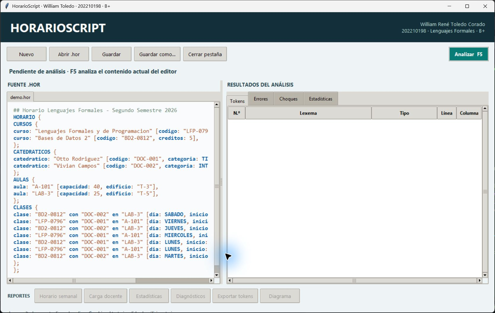
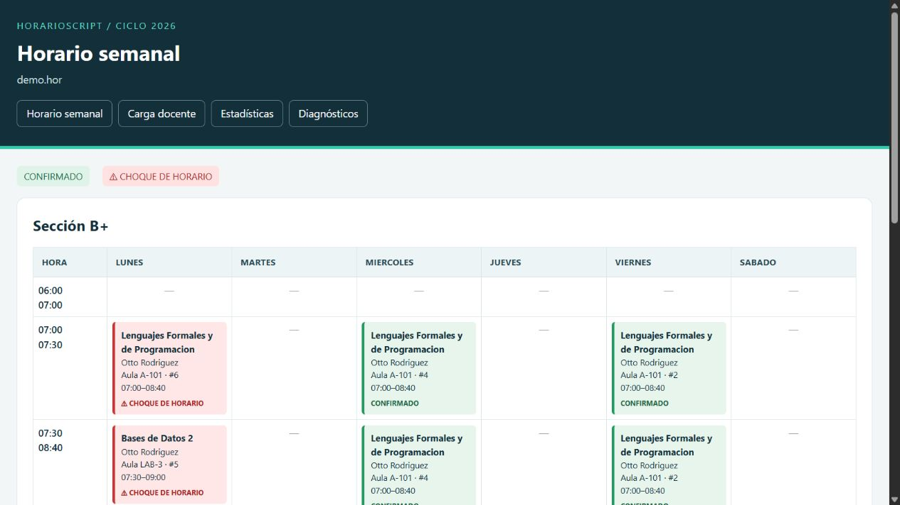
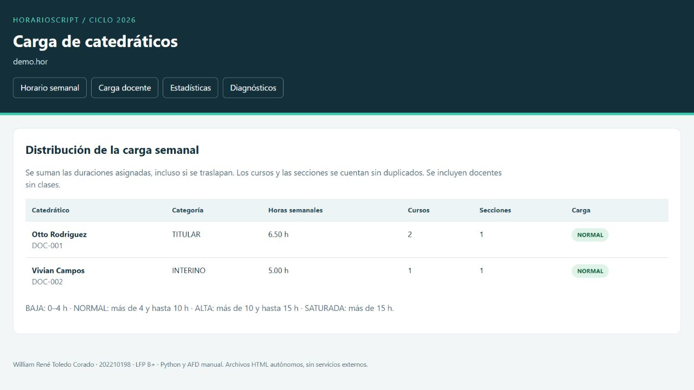
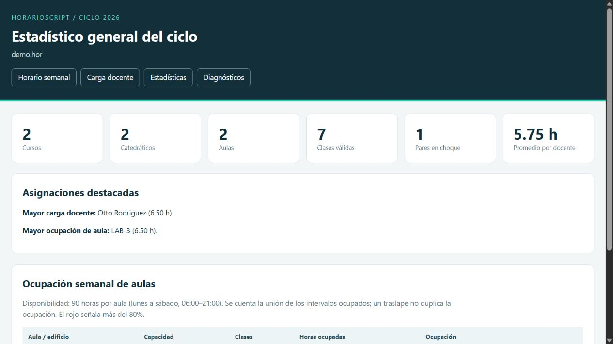
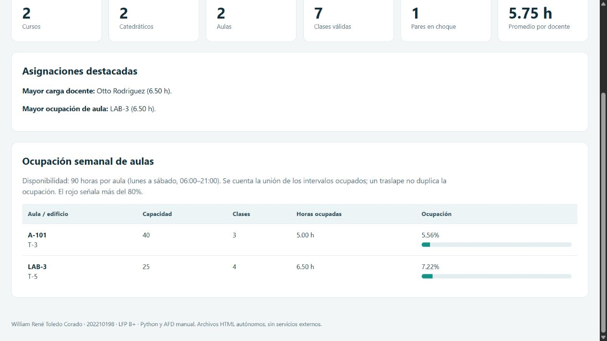

# Manual de usuario · HorarioScript

**William René Toledo Corado · 202210198 · B+**

## Ejecutar

Instale Python 3.10+ con Tcl/Tk. Desde Proyecto1: `python main.py entrada/demo.hor`. No requiere paquetes externos para funcionar.

## Abrir y editar

Abra uno o varios .hor. Cada pestaña tiene su propio editor. Un asterisco indica cambios sin guardar. Use Ctrl+S para guardar y F5 para analizar el editor actual.

## Tokens y errores

Revise las pestañas Tokens, Errores, Choques y Estadísticas. Doble clic en token/error localiza el texto. Cambiarlo invalida resultados hasta pulsar F5. Los diagnósticos léxicos, sintácticos y semánticos se distinguen. Las columnas empiezan en 1 y los tabuladores avanzan a topes de cuatro.

## Horario semanal

Una tabla por sección. Verde: confirmado; rojo: choque. El detalle indica el traslape exacto. Demo: siete clases y un choque de docente de 07:30 a 08:40 el lunes. Doble clic en Choques propone opciones sin modificar la entrada.

## Carga docente

Suma de asignaciones, cursos y secciones distintos. BAJA 0-4 h, NORMAL >4-10 h, ALTA >10-15 h, SATURADA >15 h.

## Estadísticas y ocupación

Ocupación sobre 90 horas por aula, contando la unión de intervalos. Más del 80% se pinta rojo.

## Exportar y diagramar

Exportar tokens guarda JSON/CSV. Diagrama usa Graphviz de PATH; sin él se conserva el DOT. También puede usar `dot -Tsvg horario.dot -o horario.svg`.

## Ayuda

Use `python -m tkinter` para comprobar Tcl/Tk. Use UTF-8 y extensión .hor. Corrija los errores y vuelva a analizar; los reportes parciales no certifican un horario válido. Los archivos están en salidas, con una carpeta distinta por análisis.